# boot-chat

#### 介绍
SpringBoot + websockjs + vue + element 实现仿微信风格的简易通讯功能

#### 软件架构

整体功能采用 SpringBoot + sockjs

前段界面采用 vue + element 简单设计

> 因目前开发环境网络管控的问题，使用 webjars 依赖时，无法下载到在线资源，故将静态资源包手动下载导入

#### 界面预览

#### 本地调试教程

1.  将源码导入 idea 中
    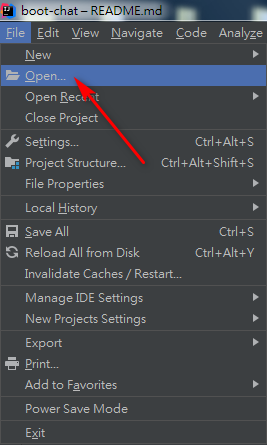
    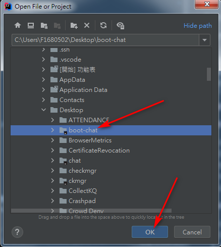
2.  同步 maven
    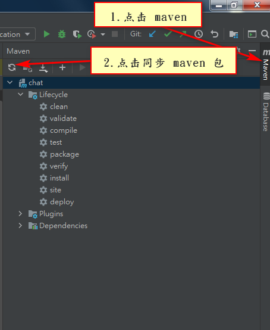
3.  检查 app.js 文件中， `connect` 方法中 SockJs 的 url 是否正确
    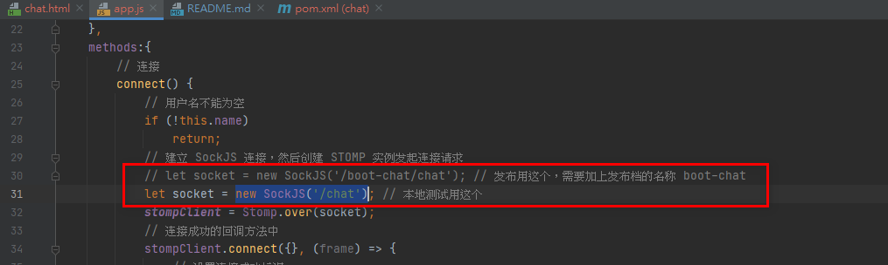
4.  运行项目 ChatApplication
    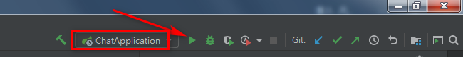
5.  访问 localhost:8080/chat.html
    

#### 发布教程

1.  将源码导入 idea 中
    
    
2.  同步 maven
    
3.  在 pom.xml 文件 build 节点下，修改发布相关配置与发布档名称，如 `boot-chat`
    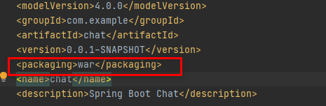
4.  在 app.js 文件中， 对 `connect` 方法中 SockJS 的 url 前面加上发布档目录名，如 `boot-chat`
    
5.  双击运行 maven 的 install 命令，进行打包
    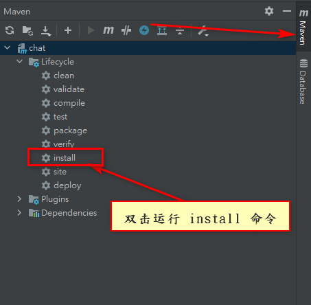
6.  将 target 目录下生成的发布档 `boot-chat.war` copy 到 tomcat 的 webapp 目录下，等候 2 秒钟左右，会自动生成对应的目录
    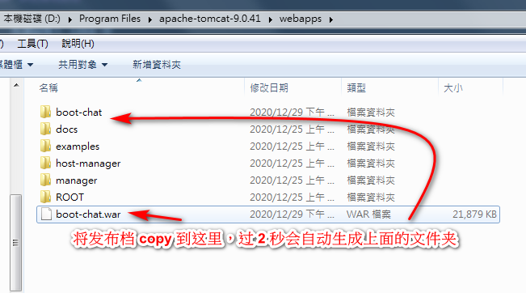
7.  访问 tomcat 所在 ip 下的该发布档目录。如 127.0.0.1::8080/boot-chat/chat.html。 这里记得要加上发布档的目录。
    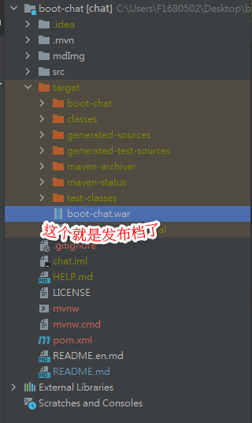
★ target 目录下的文件已上传，可以直接下载使用。

#### 使用教程

1.  输入用户名，点击 "连接" 按钮
    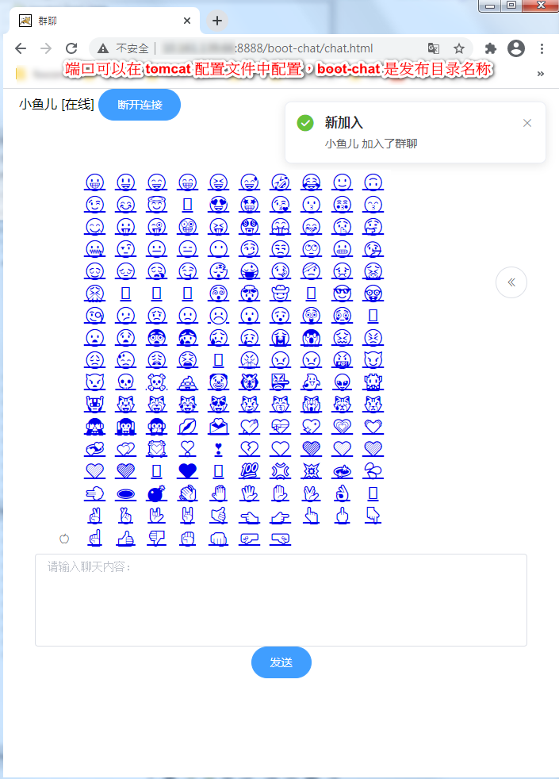
2.  输入内容，回车，或者点击 "发送" 按钮
    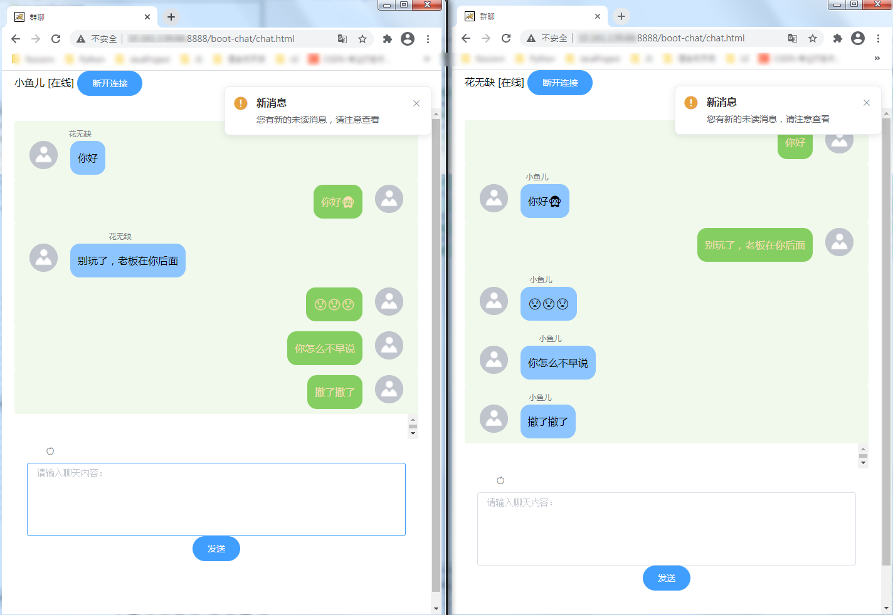
3.  可通过点击 "苹果" 按钮来选择表情发送
4.  可通过最右侧 "<" 按钮来查看历史记录